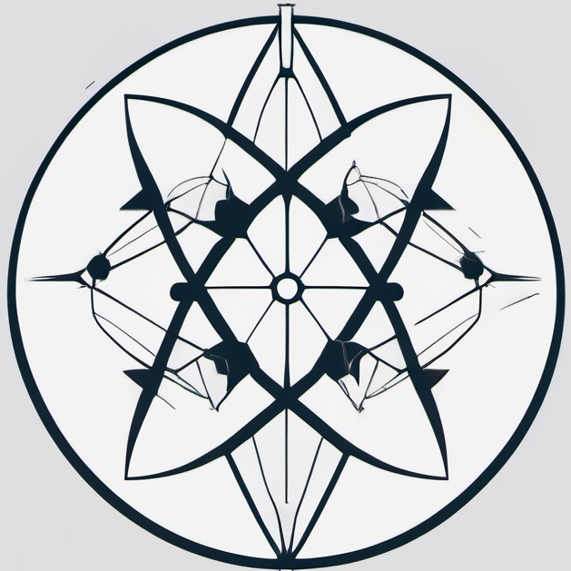
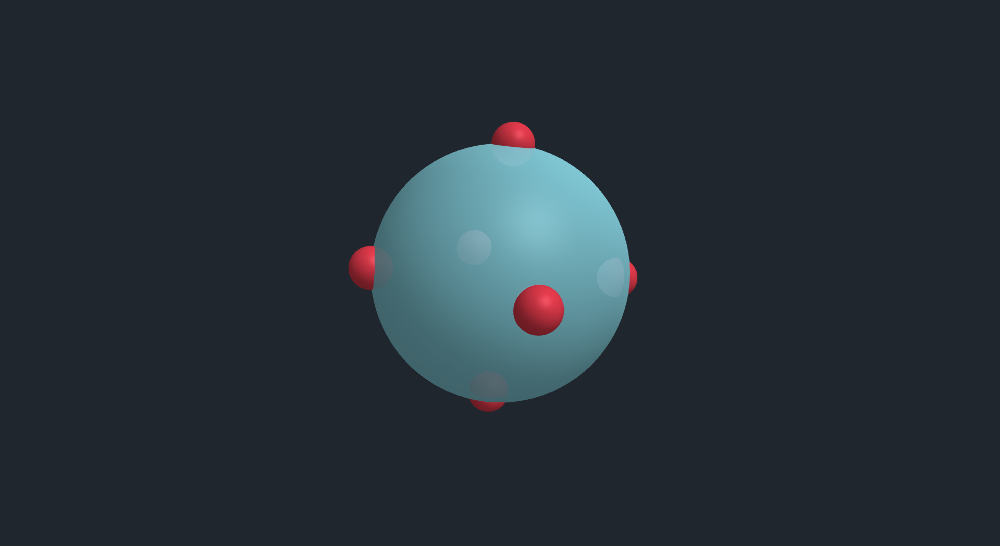
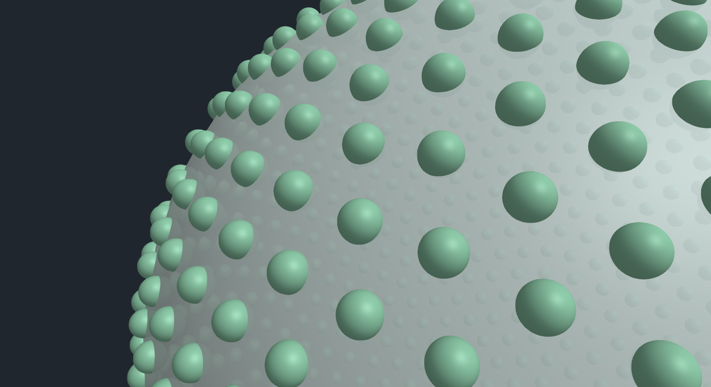
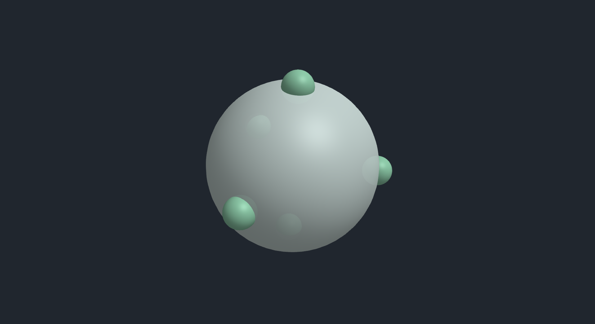

<p align="center">
  
</p>

<h1 align="center">VSEPR</h1>

This project is a Valence Shell Electron Pair Repulsion (VSEPR) model visualisation in 3D space using `GLMakie` in `Julia`. 

The particles representing atoms or electron pairs are positioned on a sphere and then repelled from each other to eventually evolve into an equilibrium configuration.

## Demo


<p align="center">
  
</p>

<details>
  <summary>View More Demo Images</summary>
<p align="center">
  
</p>
<p align="center">
  
</p>
<p align="center">
  
</p>
<p align="center">
  
</p>

  all the particle data in the Folder `VSEPR.jl/SimData/`
</details>

## Installation

1. Clone the repository:
    ```sh
    git clone https://github.com/AlmostAPhysicist/VSEPR.jl.git
    cd VSEPR.jl
    ```

2. Install the required Julia packages:
    ```julia
    using Pkg
    Pkg.activate(".")
    Pkg.instantiate()
    ```

## Usage

### Running the Simulation

<details>
  <summary>main</summary>

The `main` function initializes the simulation with a given number of particles and parameters.

```julia
function main(
    Nparticles::Int64=3, 
    central_atom_color::String=OFFWHITE, 
    ligand_color::String=LIGHT_GREEN; 
    radius::Real=1
)
```

**Parameters:**
- `Nparticles`: Number of particles/ligands to simulate around the central atom/sphere.
- `central_atom_color`: Color of the central atom/sphere.
- `ligand_color`: Color of the particles/ligands around the central atom/sphere.
- `radius`: Radius of the central atom/sphere.

**Returns:**
- `s`: Scene
- `particles`: Vector of `Particle3D` objects.

**Example:**
```julia
s, particles = main(5)
```
</details>

<details>
  <summary>evolve_space!</summary>

The `evolve_space!` function evolves the simulation over a number of iterations.

```julia
function evolve_space!(
    particles::Vector{Particle3D{Float64}};
    iterations::Int64=1000,
    force_factor::Real=3*10^(-1-log10(length(particles))), 
    radius::Real=1,
    show_evolution::Bool=true,
    time::Real=10
)
```

**Parameters:**
- `particles`: Vector of `Particle3D` objects that is to be evolved over time.
- `iterations`: Number of iterations for the simulation.
- `force_factor`: Factor for the repulsive force between particles/ligands.
- `radius`: Radius of the central atom/sphere.
- `show_evolution`: Boolean to show the evolution of the system.
- `time`: Total time for the simulation.

**Example:**
```julia
evolve_space!(particles, time=15)
```
</details>

To run the simulation, use the `main` and `evolve_space!` functions in `Simulation/main.jl`:

```julia
s, particles = main(5)
evolve_space!(particles, time=10)
```
This will initialize the simulation with 5 particles and evolve the system over time.
To enjoy the evolution and play around with it, you can set `time` to be longer and/or `force_factor` to be smaller for slower evolution.

You can pan around, zoom, rotate, etc with the Makie window using the Mouse or keyboard

### Saving the Simulation

To save the simulation, use the `save_content` and `load_content` functions in `VSEPR.jl/SimData/SaveLoad.jl`

```julia
include("SimData/SaveLoad.jl")
using .SaveLoad
save_content("MyFilePath.json", particles) 
#file extension doesn't matter - it can be a json, dat, txt, anything! (even nothing)
#content need not be only particles

restored_particles = load_content("MyFilePath.json")
```

#### Particle Structs

The simulation uses a custom `Particle3D` struct to represent particles in 3D space. This struct includes observable properties for position, velocity, acceleration, mass, charge, color, shape, size, and transparency.

<details>
  <summary>Particle3D</summary>

```julia
struct Particle3D{T<:Real} <: Particle
    pos::Observable{Point{3,T}}
    vel::Observable{Point{3,T}}
    acc::Observable{Point{3,T}}
    mass::T
    charge::T
    color::Observable{String}
    shape::Observable
    size::Observable{T}
    alpha::Observable{T}
end
```
</details>

## License

This project is licensed under the Apache 2.0 License.

## Contributing

Contributions are welcome! Feel free to open an issue or submit a pull request.

## Acknowledgments

This project uses [GLMakie](https://github.com/JuliaPlots/GLMakie.jl) for visualization and [GeometryBasics](https://github.com/JuliaGeometry/GeometryBasics.jl) for geometry definitions.

Danisch & Krumbiegel, (2021). Makie.jl: Flexible high-performance data visualization for Julia.
Journal of Open Source Software, 6(65), 3349, https://doi.org/10.21105/joss.03349

Regardless of the need to mention, [Julia](https://github.com/JuliaLang/julia) is an incredible language to work with.
```
